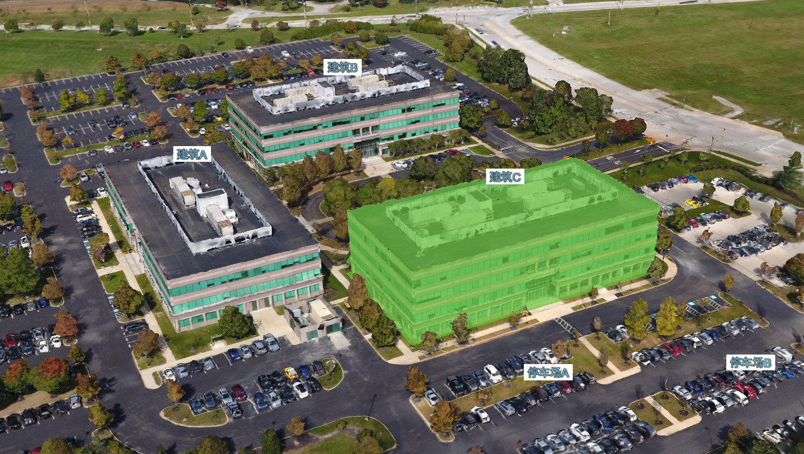
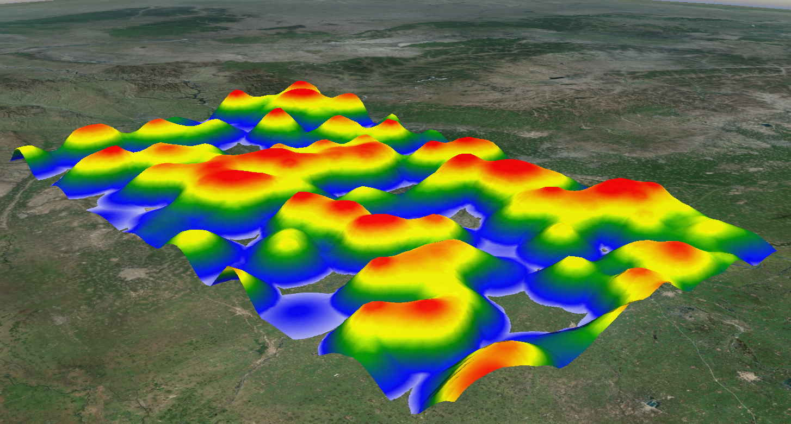

## 🌟 项目名称
> **mbs-cesium-example**  
> cesium示例开源


---

## 📋 项目简介  
**项目名称** 是一个开源项目，旨在提供：  
- 🚀 快速解决 XXX 问题  
- 🌈 易于使用的 XXX 功能  
- 🔒 安全高效的 XXX 解决方案  

---

## 🔧 功能列表  
- ✅ 功能一：3dtiles区域高亮 
- 🌐 功能二：真3d热力图 
- 📊 功能三：漫游/飞行 

---

## 截图




---

## 📦 安装和使用  
### 环境要求  
 

### 安装步骤  
```bash
# 克隆项目
git clone https://gitee.com/mapbs/mbs-cesium-example.git


使用vscode++ 打开项目
使用live server打开一个动态地址直接访问根目录下的index.html

